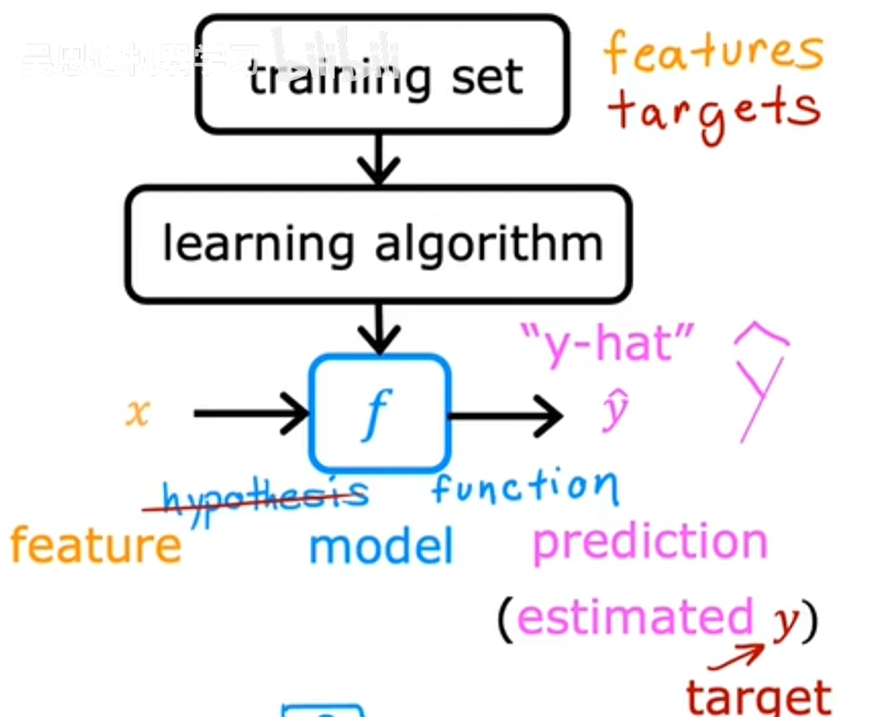

* Machine learning algorithms:

  * supervised learning
    * used most in real-world applications
    * rapid advancements
  * unsupervised learning

  

* practical advice for applying learning algorithms

  * input -> output

    Learns from being given "right answers".

* example: Housing price prediction - regression

### Linear Regression with One Variable

univariate linear regression

* Terminologies:

  * The training set

  * x: the input variable, is also called a feature or an input feature.

  * y: the output variable, is also called a "target" variable.

  * row: each row represents a different training example.

  * m: number of training examples

  * (x, y): single training example

  * (x superscript (i), y superscript (i)): the superscript tells us that is the i-th training example.

    i here, refers to a specific row in the table.

* process:
  1. input: the training set, includes features and targets.

  2. learning algorithm

  3. output: x->f->y-hat

     

* A training set includes:

  * input features

  * output targets
    $$
    f_{w,b}(x)=wx+b
    $$

  * w, b: parameters, the variables you can adjust during training in order to improve the model.

    Also referred to coefficients/weights.

### Cost Function

* squared error cost function: 
  $$
  J(w,b)=\frac{1}{2m}\sum_{i=1}^{m}(\hat{y}^{(i)}-y^{(i)})^2
  $$

  * how to measure how well a line fits the training data.
  * error:  $\hat{y}^{(i)}-y^{(i)}$
  * to build a cost function that doesn't automatically get bigger as the training set size gets larger,  by convention, we will compute the **average** squared error.
  * The extra division by 2 is just the convention.

* simplified: b = 0

* Model:  
  $$
  f_{w,b}(x) = wx+b
  $$

* Parameters: $$w,b$$

* Cost Function:
  $$
  J(w,b) = \frac{1}{2m}\sum_{i=1}^m(f_{w,b}(x^{(i)}-y^{(i)})^2
  $$

* Contour plots:

  

##  Gradient Descent

* cost function for linear regression: $$J(w,b)$$

  Gradient decent is an algorithm that you can use to try to minimize any function.

  want: $$min_{w,b} J(w,b)$$

* outline:

  1. initial guess: set w=0, b=0.
  2. keep changing w, b to reduce J(w,b), until we settle at or near a minimum.

* directions of steepest decent.

* local minima

###  Implement Gradient Descent

* Gradient descent algorithm:
  
  each step:
  $$
  w=w-\alpha\partialderivative{J(w,b)}{w}
  $$
  
  $$
  b=b-\alpha\partialderivative{J(w,b)}{b}
  $$
  
  
  
  * alpha: the learning rate, a small positive number between 0 and 1.
    * alpha controls how big of a step you take downhill. 
    * if alpha is very large, then that corresponds to a very aggressive gradient descent procedure where you're trying to take huge steps downhill.
  * derivative term of cost function J
    * in combination with the learning rate alpha, it also determines the size of the steps you want to take downhill.
  * repeat until convergence:
    * convergence: you reach the point at a local minimum where the parameters w and b no longer change much with each additional step that you take.
    *  simultaneously update w and b
    * 

